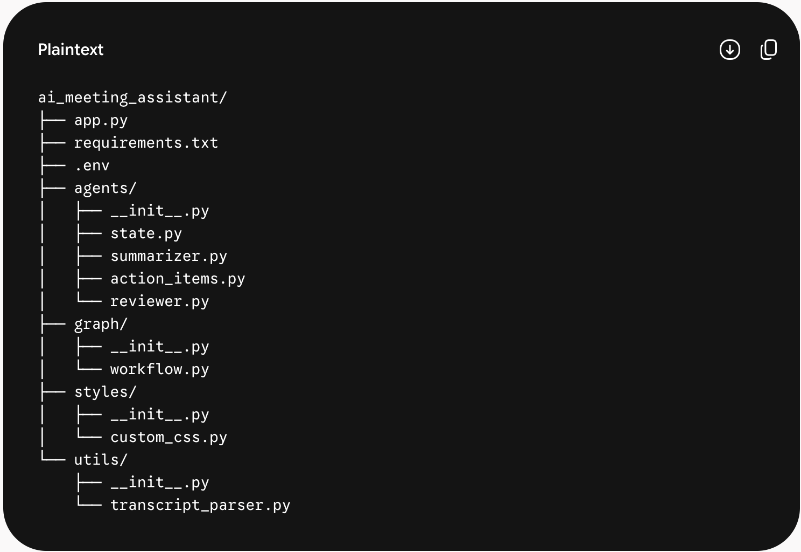
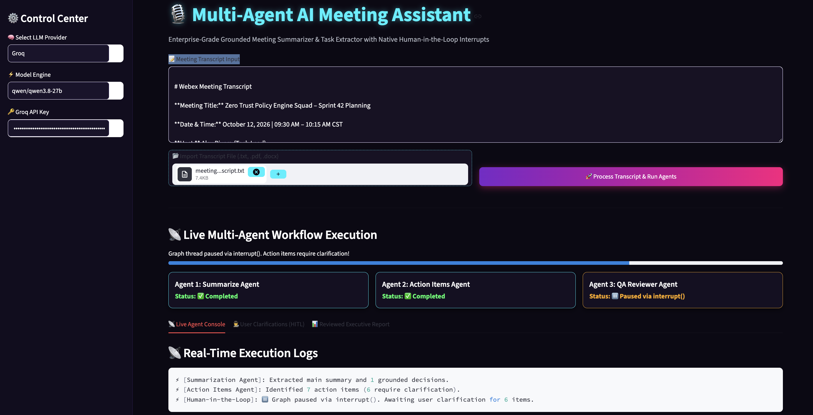
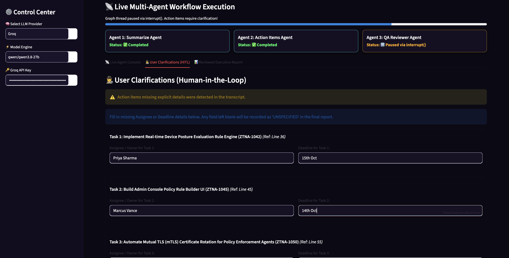
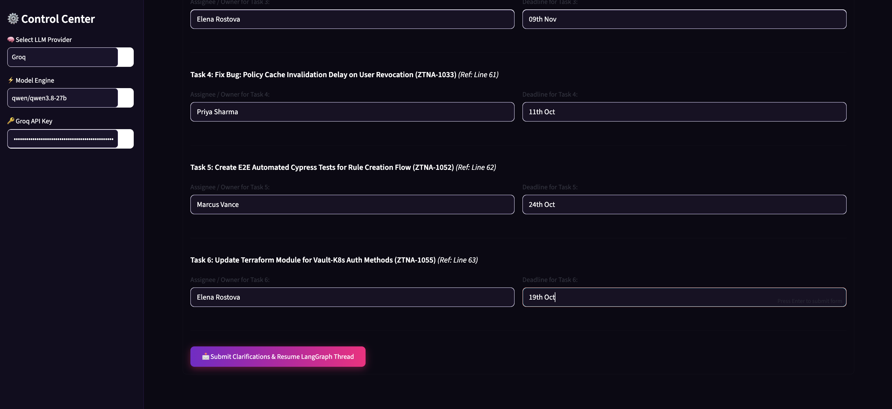
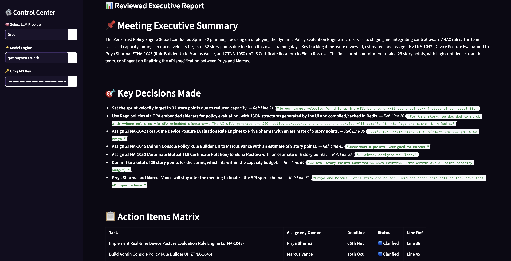
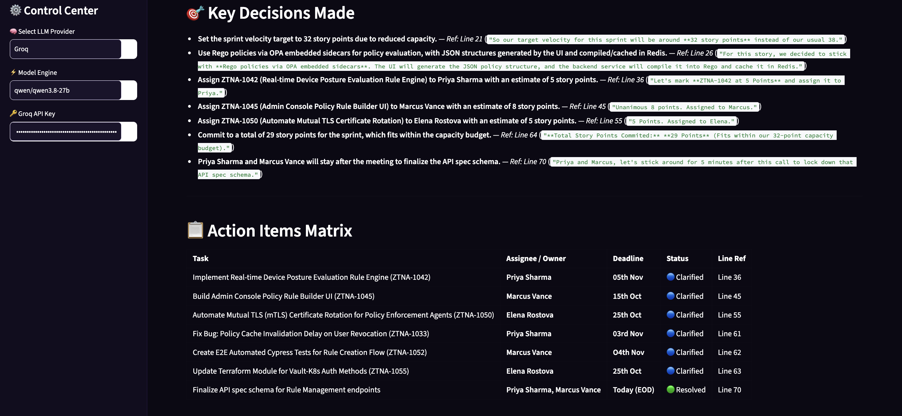
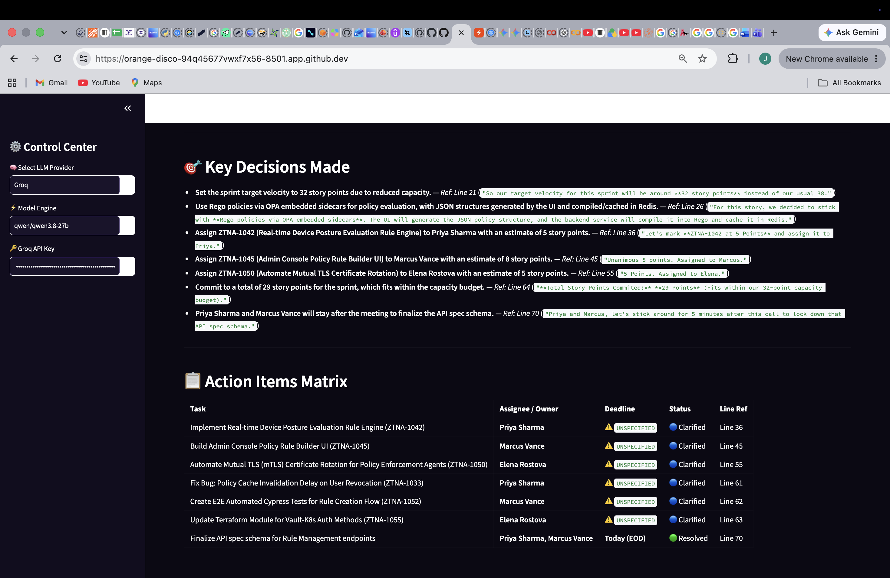
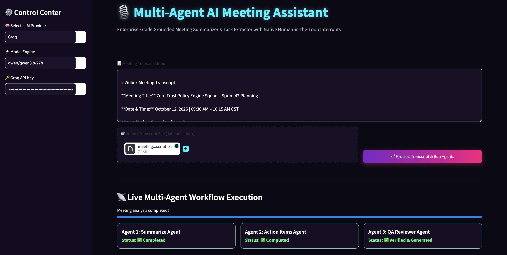
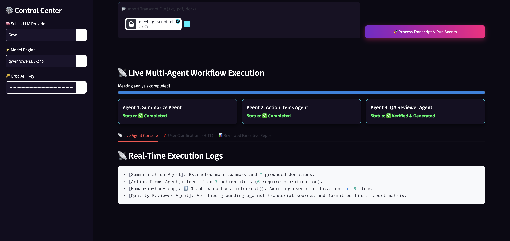
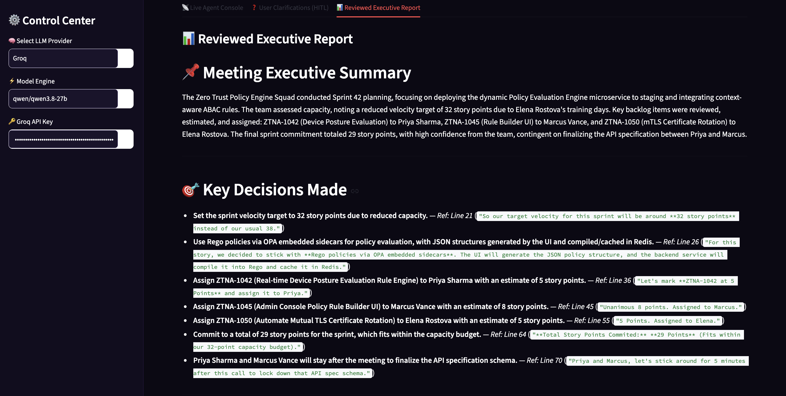

### 🏗️ Agentic Meeting Assistant Architecture & Overview

Implement the multi-agent AI Meeting Assistant built with LangGraph, Streamlit, and Human-in-the-Loop(interrupt / Command) orchestration.

#### How to Setup

<!--
- python -m venv venv
- source venv/bin/activate
- pip install -r requirements.txt
- streamlit run app.py
-->

#### 🏗️ 1. Multi-Agent Graph Architecture

Organize your Python project structure as follows:

                   [ Input Meeting Transcript ]
                                │
                                ▼
                       ┌────────────────┐
                       │ Summarizer     │ (Identifies topics & decisions)
                       └───────┬────────┘
                                │
                                ▼
                       ┌────────────────┐
                       │ Action Items   │ (Extracts tasks, owners, deadlines)
                       └───────┬────────┘
                                │
                                ▼
                       ┌────────────────┐
                       │ QA Reviewer    │ (Validates grounding against transcript)
                       └───────┬────────┘
                                │
                      (Needs Clarification?)
                             ╱     ╲
                           YES      NO
                           ╱         ╲
                          ▼           ▼
        ┌──────────────────┐         ┌────────────────┐
        │ Human Interrupt  │         │ Final Report   │
        │  (Streamlit UI)  │         │ Generator      │
        └────────┬─────────┘         └────────────────┘
                 │ (Command(resume=...))
                 ▼
        ┌──────────────────┐
        │ Reviewer Re-Eval │
        └────────┬─────────┘
                 │
                 ▼
        ┌──────────────────┐
        │ Final Report     │
        └──────────────────┘

##### Primary Highlights

Grounding Accuracy (WebEx/Google Meet standards): Every decision and action item is mapped directly to line numbers and exact transcript excerpts.

Strict Factuality: Agents flag ambiguous or missing deadlines/owners rather than hallucinating facts.

Native LangGraph Interruption: Uses interrupt() to trigger a Human-in-the-Loop clarification dialog in Streamlit, and Command(resume=...) to seamlessly resume graph execution.

Live Execution Console: Displays real-time progress cards, agent activity logs, and transparent state evolution.

##### Directory Structure

#### 🚀 How to Run the Application

Install requirements: pip install -r requirements.txt

Run Streamlit app: streamlit run app.py

Interact with the app:
Select theme (Cyberpunk, Dark Modern, Neon Matrix) in the sidebar.  
Enter your API Key (Groq or OpenAI).  
Upload any .pdf, .docx, or .txt document.
Click 🚀 Process Document & Run
Agents to execute the multi-agent workflow.

#### Sample output screens

<Done>
