### Agentic AI Study Assistant

Implement the Multi-Agent "Agentic AI Study Assistant" using LangGraph orchestrator workflow and a Streamlit UI

#### How to Setup

<!--
- python -m venv venv
- source venv/bin/activate
- pip install -r requirements.txt
- streamlit run app.py
-->

#### 🏗️ 1. Project Architecture & Directory Structure

Organize your Python project structure as follows:

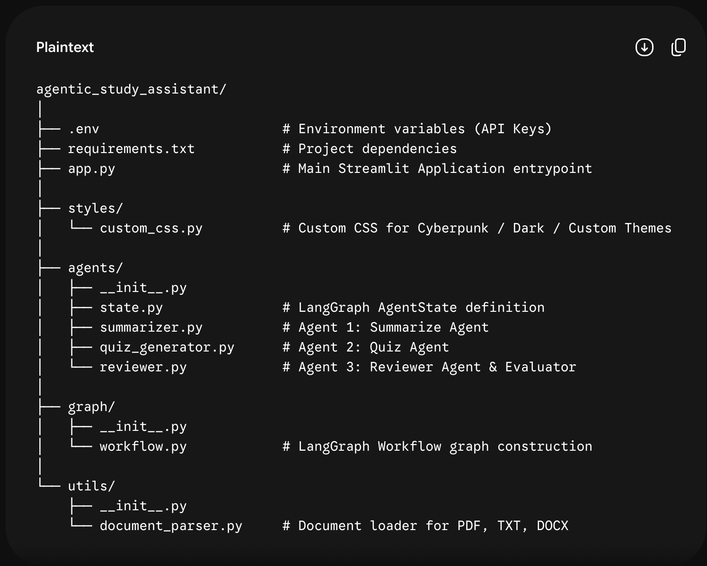

##### Real-time Progressive Tab Population:

Tab 1 (📑 Topic Summary): Automatically populates and displays as soon as the Summarize Agent node completes execution.

Tab 2 (📝 Quiz Assessment): Automatically displays the 5 MCQs as soon as the Quiz Agent finishes, accompanied by a 3-minute countdown timer.

##### Automated Submission on Timeout:

Uses Streamlit's session timer logic. If the 3 minutes expire before manual submission, the quiz auto-submits current selections for evaluation.

##### Reviewer Evaluation in Tab 3 (🕵️ Reviewer Corrections):

The Reviewer Agent evaluates user answers and delivers a breakdown with personalized feedback and marks directly inside Tab 3.

##### Agent Activity Logs moved to Tab 4 (⚙️ Agent Logs):

Tab 4 hosts execution logs and self-correction audit records.

#### 🚀 How to Run the Application

Install requirements: pip install -r requirements.txt

Run Streamlit app: streamlit run app.py

Interact with the app:
Select theme (Cyberpunk, Dark Modern, Neon Matrix) in the sidebar.  
Enter your API Key (Groq or OpenAI).  
Upload any .pdf, .docx, or .txt document.
Click 🚀 Process Document & Run
Agents to execute the multi-agent workflow.

#### Sample output screens

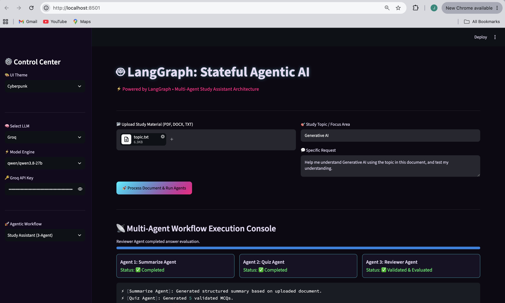

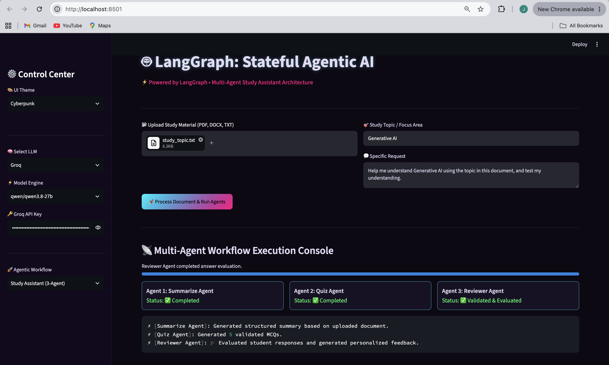

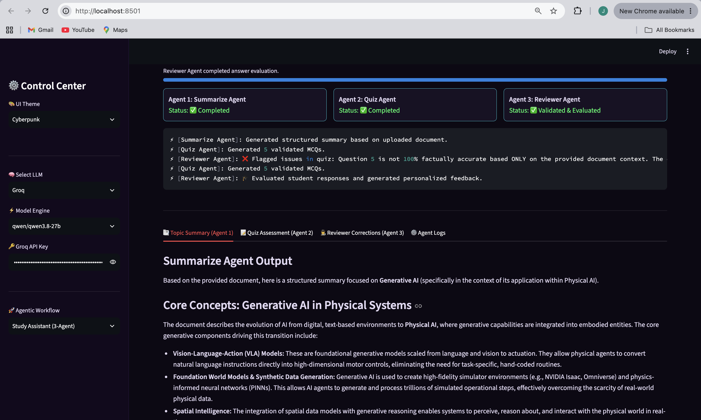

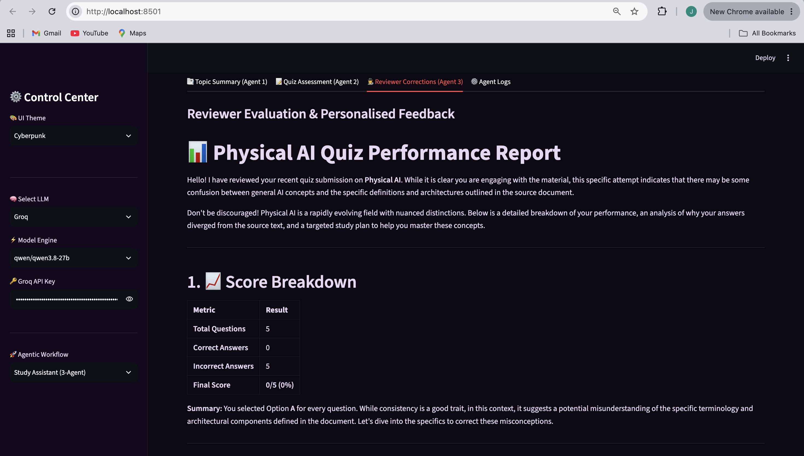

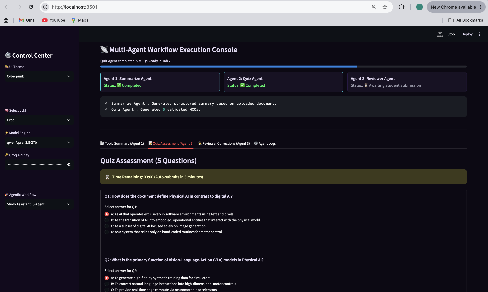

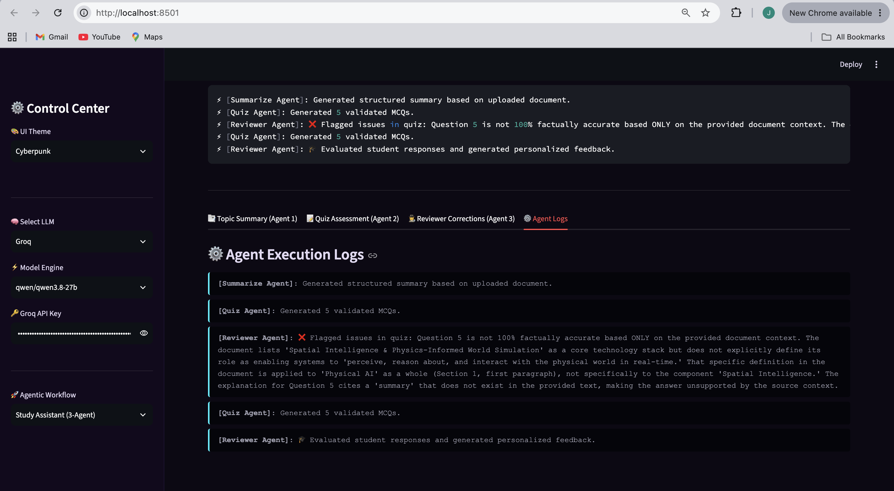

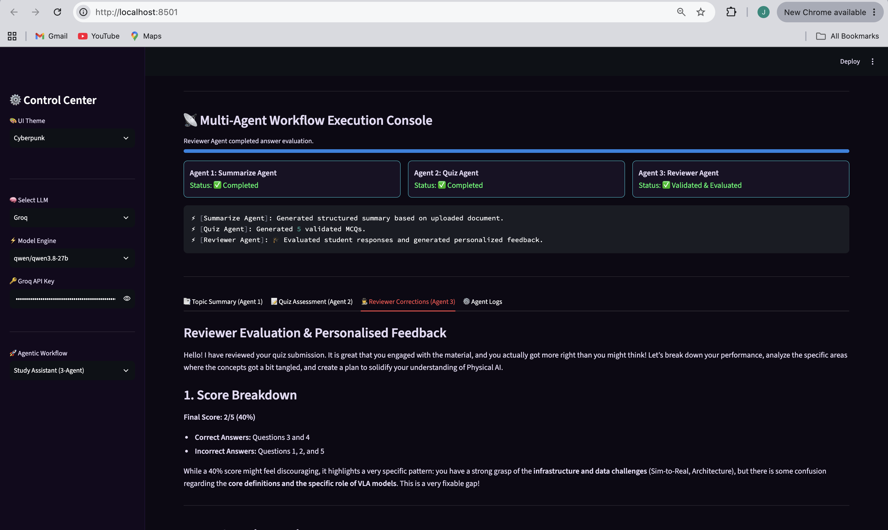

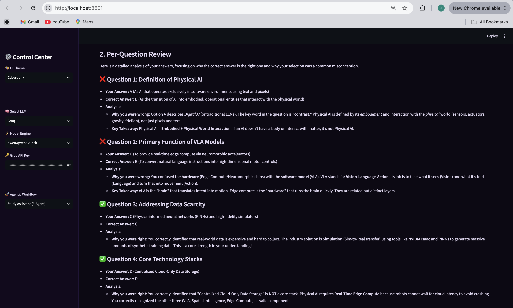

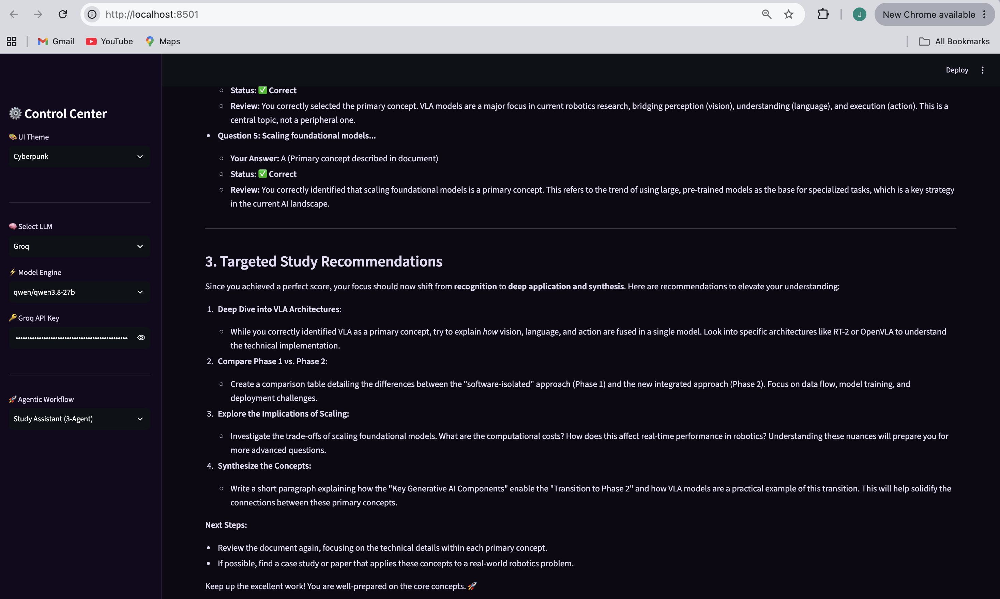

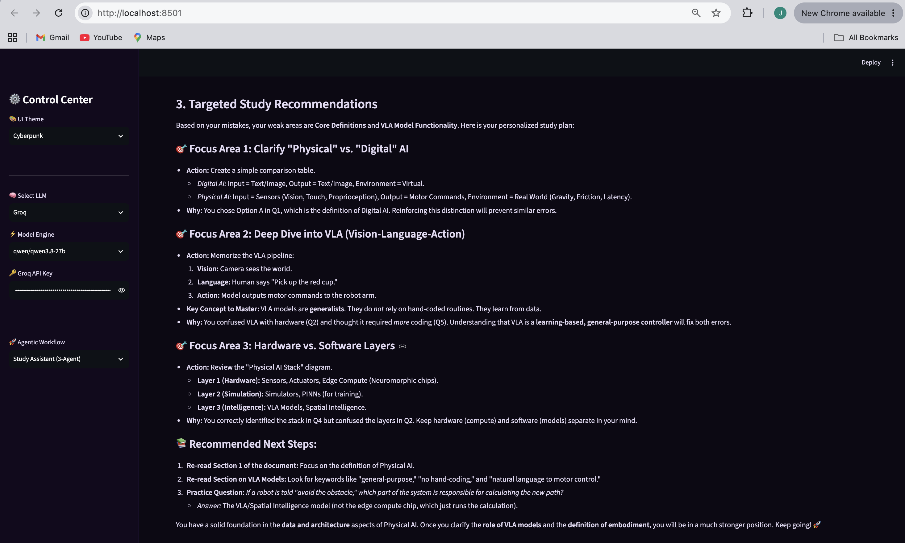

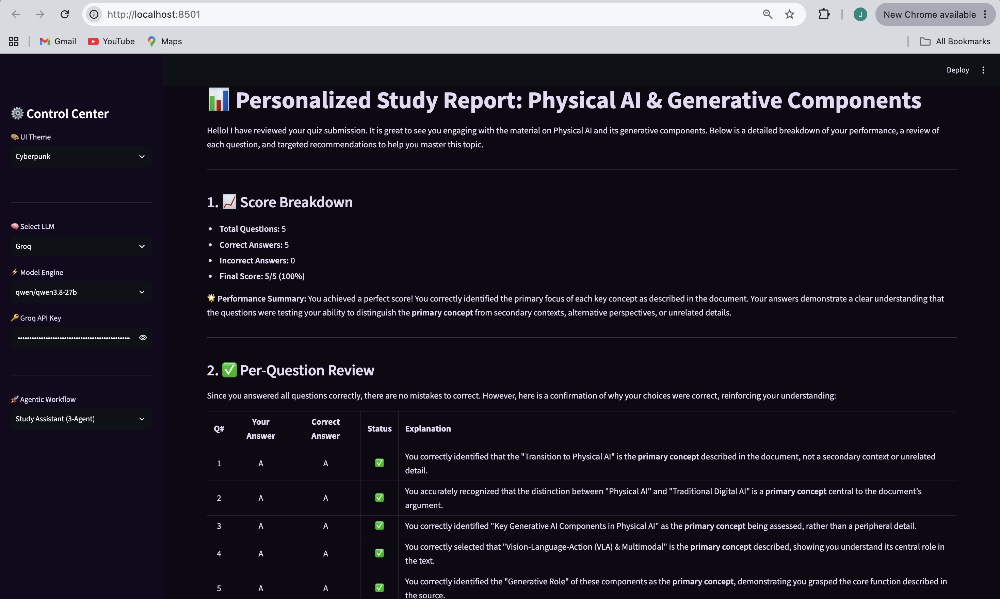
<Done>
